# CLion远程Jetson Nano布署调试ncnn

# 1. Requirements

- CLion
- ncnn
- Jetson nano

# 2. [Build ncnn for NVIDIA Jetson nano](https://github.com/Tencent/ncnn/wiki/how-to-build#build-for-linux)

# 3. CLion远程调试ncnn

- 参考链接
    - [留在本地，让 IDE 替您处理远程工作！](https://blog.jetbrains.com/zh-hans/2019/04/17/ide/)
    - [使用Clion优雅的完全远程自动同步和远程调试c++](https://cloud.tencent.com/developer/article/1406250)
- 选择**File->Settings->Build|Execution|Deloyment->Toolchains**添加远程工具链。

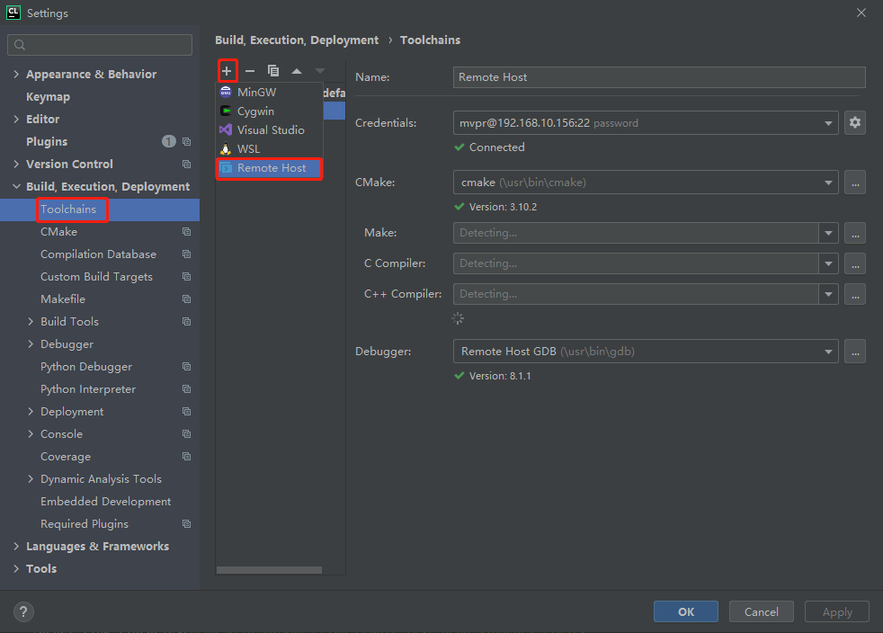

- 设置远程ssh连接

    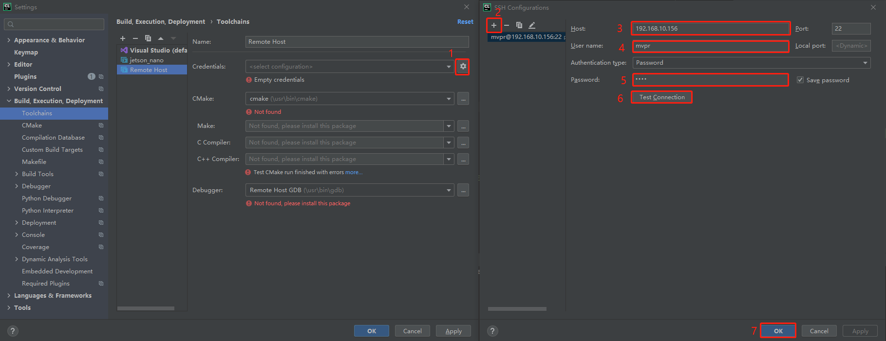

- 设置好ssh连接后，会自动检测CMake等环境，点击应用即可。

    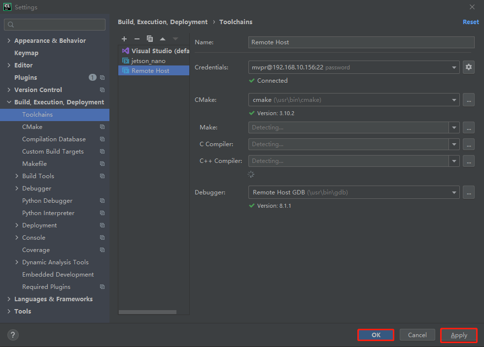

- 设置CMake编译位置，Release和Debug两种方式设置方法相同，以Release举例。

    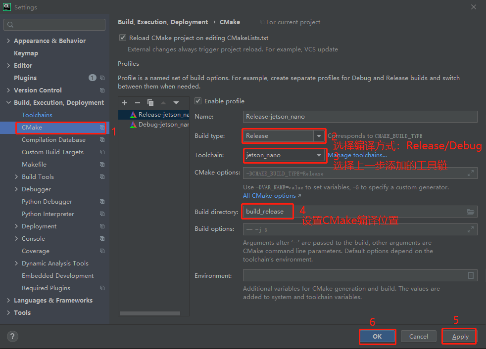

- 选择**Tools->Deployments->Brose remote Host**打开远程文件浏览器。

    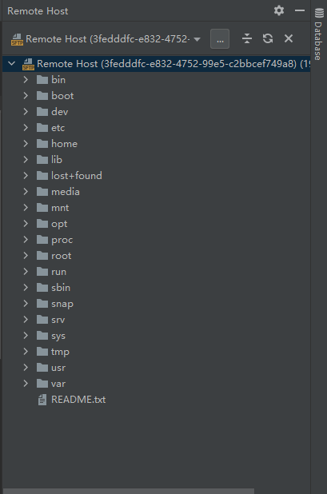

- 设置远程映射文件夹

    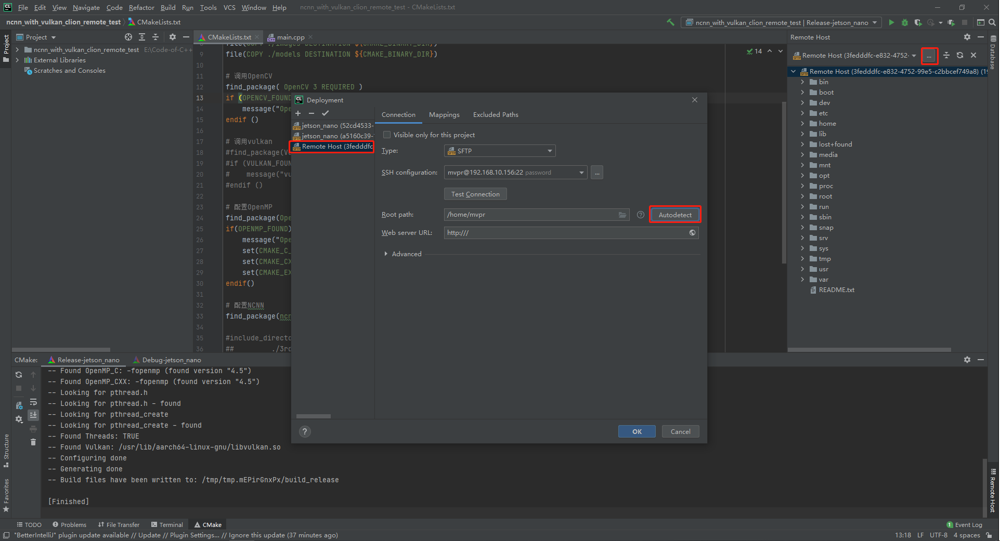

    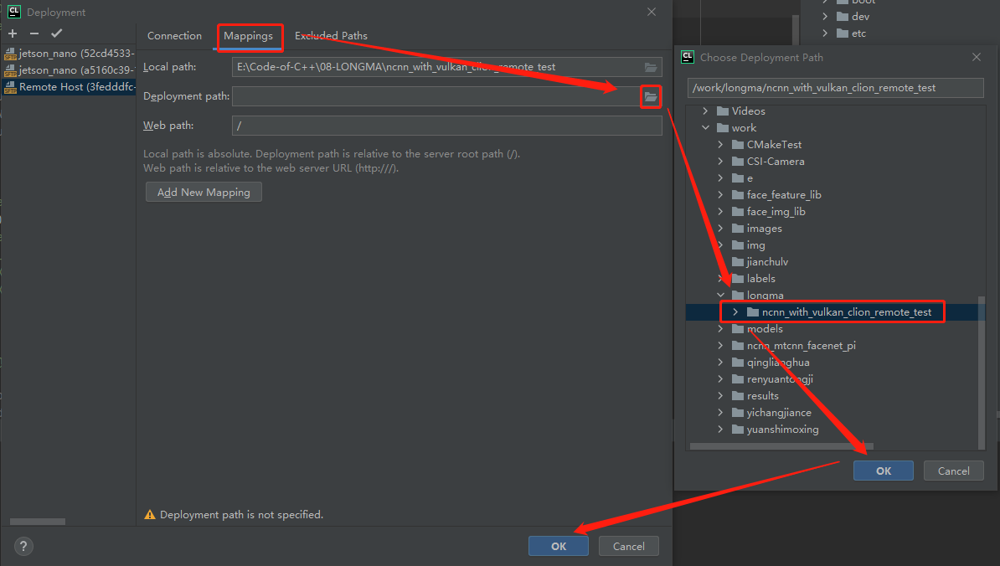

- 选择**File->New Project->C++ exxcutable**创建ncnn工程。

    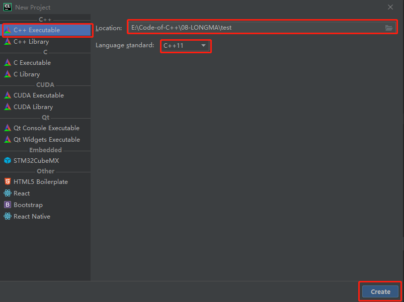

- 选择编译工具链，并设置CMake编译目录。参考前面的步骤。

- 设置远程映射目录。参考前面的步骤。

- 配置工程目录如下图所示。

    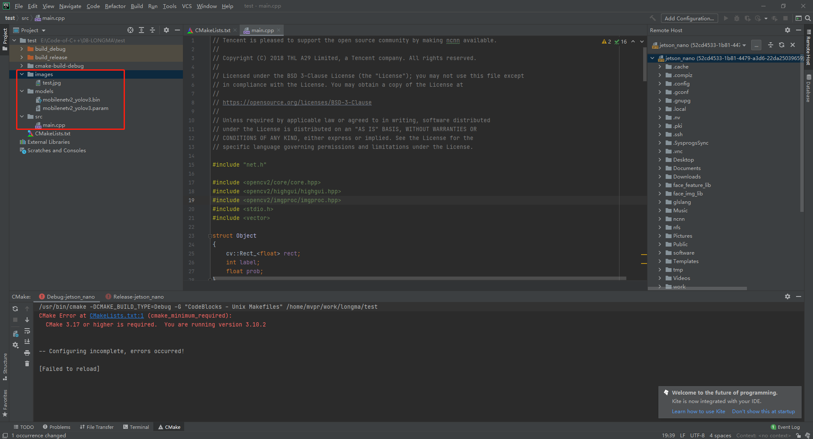

- 本次工程以yolov3进行测试，因此在main.cpp中添加如下代码。

    ```c++
    // Tencent is pleased to support the open source community by making ncnn available.
    //
    // Copyright (C) 2018 THL A29 Limited, a Tencent company. All rights reserved.
    //
    // Licensed under the BSD 3-Clause License (the "License"); you may not use this file except
    // in compliance with the License. You may obtain a copy of the License at
    //
    // https://opensource.org/licenses/BSD-3-Clause
    //
    // Unless required by applicable law or agreed to in writing, software distributed
    // under the License is distributed on an "AS IS" BASIS, WITHOUT WARRANTIES OR
    // CONDITIONS OF ANY KIND, either express or implied. See the License for the
    // specific language governing permissions and limitations under the License.
    
    #include "net.h"
    
    #include <opencv2/core/core.hpp>
    #include <opencv2/highgui/highgui.hpp>
    #include <opencv2/imgproc/imgproc.hpp>
    #include <stdio.h>
    #include <vector>
    
    struct Object
    {
        cv::Rect_<float> rect;
        int label;
        float prob;
    }
    ;
    
    static int detect_yolov3(const cv::Mat& bgr, std::vector<Object>& objects)
    {
        ncnn::Net yolov3;
    
        yolov3.opt.use_vulkan_compute = false;
    
        // original pretrained model from https://github.com/eric612/MobileNet-YOLO
        // param : https://drive.google.com/open?id=1V9oKHP6G6XvXZqhZbzNKL6FI_clRWdC-
        // bin : https://drive.google.com/open?id=1DBcuFCr-856z3FRQznWL_S5h-Aj3RawA
        // the ncnn model https://github.com/nihui/ncnn-assets/tree/master/models
        yolov3.load_param("./models/mobilenetv2_yolov3.param");
        yolov3.load_model("./models/mobilenetv2_yolov3.bin");
    
        const int target_size = 352;
    
        int img_w = bgr.cols;
        int img_h = bgr.rows;
    
        ncnn::Mat in = ncnn::Mat::from_pixels_resize(bgr.data, ncnn::Mat::PIXEL_BGR, bgr.cols, bgr.rows, target_size, target_size);
    
        const float mean_vals[3] = { 127.5f, 127.5f, 127.5f };
        const float norm_vals[3] = { 0.007843f, 0.007843f, 0.007843f };
        in.substract_mean_normalize(mean_vals, norm_vals);
    
        ncnn::Extractor ex = yolov3.create_extractor();
    
        ex.input("data", in);
    
        ncnn::Mat out;
        ex.extract("detection_out", out);
    
        //     printf("%d %d %d\n", out.w, out.h, out.c);
        objects.clear();
        for (int i = 0; i < out.h; i++)
        {
            const float* values = out.row(i);
    
            Object object;
            object.label = values[0];
            object.prob = values[1];
            object.rect.x = values[2] * img_w;
            object.rect.y = values[3] * img_h;
            object.rect.width = values[4] * img_w - object.rect.x;
            object.rect.height = values[5] * img_h - object.rect.y;
    
            objects.push_back(object);
        }
    
        return 0;
    }
    
    static void draw_objects(const cv::Mat& bgr, const std::vector<Object>& objects)
    {
        static const char* class_names[] = {
                "background",
                "aeroplane",
                "bicycle",
                "bird",
                "boat",
                "bottle",
                "bus",
                "car",
                "cat",
                "chair",
                "cow",
                "diningtable",
                "dog",
                "horse",
                "motorbike",
                "person",
                "pottedplant",
                "sheep",
                "sofa",
                "train",
                "tvmonitor"
        };
    
        cv::Mat image = bgr.clone();
    
        for (size_t i = 0; i < objects.size(); i++)
        {
            const Object& obj = objects[i];
    
            fprintf(stderr,
                    "%d = %.5f at %.2f %.2f %.2f x %.2f\n",
                    obj.label,
                    obj.prob,
                    obj.rect.x,
                    obj.rect.y,
                    obj.rect.width,
                    obj.rect.height);
    
            cv::rectangle(image, obj.rect, cv::Scalar(255, 0, 0));
    
            char text[256];
            sprintf(text, "%s %.1f%%", class_names[obj.label], obj.prob * 100);
    
            int baseLine = 0;
            cv::Size label_size = cv::getTextSize(text, cv::FONT_HERSHEY_SIMPLEX, 0.5, 1, &baseLine);
    
            int x = obj.rect.x;
            int y = obj.rect.y - label_size.height - baseLine;
            if (y < 0)
                y = 0;
            if (x + label_size.width > image.cols)
                x = image.cols - label_size.width;
    
            cv::rectangle(image,
                          cv::Rect(cv::Point(x, y), cv::Size(label_size.width, label_size.height + baseLine)),
                          cv::Scalar(255, 255, 255),
                          -1);
    
            cv::putText(image,
                        text,
                        cv::Point(x, y + label_size.height),
                        cv::FONT_HERSHEY_SIMPLEX,
                        0.5,
                        cv::Scalar(0, 0, 0));
        }
    
        cv::imshow("image", image);
        cv::waitKey(0);
    }
    
    int main(int argc, char** argv)
    {
        if (argc != 2)
        {
            fprintf(stderr, "Usage: %s [imagepath]\n", argv[0]);
            return -1;
        }
    
        const char* imagepath = argv[1];
    
        cv::Mat m = cv::imread(imagepath, 1);
        if (m.empty())
        {
            fprintf(stderr, "cv::imread %s failed\n", imagepath);
            return -1;
        }
    
        std::vector<Object> objects;
        detect_yolov3(m, objects);
    
        draw_objects(m, objects);
    
        return 0;
    }
    
    ```

- 修改CMakeLists.txt

    - ```cmake
        # 根据自己的CMake版本设置
        cmake_minimum_required(VERSION 3.17) 
        ```

    - ```cmake
        # 复制文件，将模型文件夹和测试图像文件夹复制到CMake编译文件夹中，以便于编译好的二进制文件找到对应的模型文件和测试图像。
        file(COPY ./images DESTINATION ${CMAKE_BINARY_DIR})
        file(COPY ./models DESTINATION ${CMAKE_BINARY_DIR})
        ```

    - ```cmake
        # 配置NCNN，设置编译好的ncnn库目录
        set(ncnn_DIR ~/software/ncnn_with_vulkan/lib/cmake/ncnn)
        find_package(ncnn)
        ```

    - ```cmake
        # 调用OpenCV
        find_package( OpenCV 3 REQUIRED )
        if (OPENCV_FOUND)
            message("OpenCV Found.")
        endif ()
        ```

    - ```cmake
        # 配置OpenMP
        find_package(OpenMP REQUIRED)
        if(OPENMP_FOUND)
            message("OpenMP Found.")
            set(CMAKE_C_FLAGS "${CMAKE_C_FLAGS} ${OpenMP_C_FLAGS}")
            set(CMAKE_CXX_FLAGS "${CMAKE_CXX_FLAGS} ${OpenMP_CXX_FLAGS}")
            set(CMAKE_EXE_LINKER_FLAGS "${CMAKE_EXE_LINKER_FLAGS} ${OpenMP_EXE_LINKER_FLAGS}")
        endif()
        ```

    - ```cmake
        # 生成可执行文件
        add_executable(ncnn_test src/main.cpp)
        # 链接库文件
        target_link_libraries(ncnn_test ncnn ${OpenCV_LIBS})
        ```

    完整CMakeLists.txt

    ```cmake
    cmake_minimum_required(VERSION 3.10)
    project(ncnn_test)
    
    set(CMAKE_CXX_STANDARD 11)
    
    # 复制文件
    file(COPY ./images DESTINATION ${CMAKE_BINARY_DIR})
    file(COPY ./models DESTINATION ${CMAKE_BINARY_DIR})
    
    # 调用OpenCV
    find_package( OpenCV 3 REQUIRED )
    if (OPENCV_FOUND)
        message("OpenCV Found.")
    endif ()
    
    # 配置OpenMP
    find_package(OpenMP REQUIRED)
    if(OPENMP_FOUND)
        message("OpenMP Found.")
        set(CMAKE_C_FLAGS "${CMAKE_C_FLAGS} ${OpenMP_C_FLAGS}")
        set(CMAKE_CXX_FLAGS "${CMAKE_CXX_FLAGS} ${OpenMP_CXX_FLAGS}")
        set(CMAKE_EXE_LINKER_FLAGS "${CMAKE_EXE_LINKER_FLAGS} ${OpenMP_EXE_LINKER_FLAGS}")
    endif()
    
    # 配置NCNN
    set(ncnn_DIR ~/software/ncnn_with_vulkan/lib/cmake/ncnn)
    find_package(ncnn)
    
    add_executable(ncnn_test src/main.cpp)
    
    target_link_libraries(ncnn_test ncnn ${OpenCV_LIBS})
    ```

- 设置程序运行参数（**Edit Configurations**），编译执行程序。

    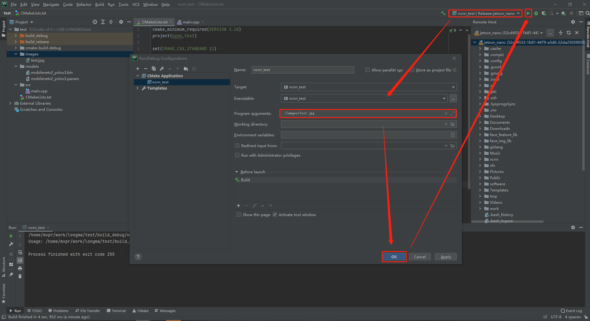

- 程序正确执行将出现以下结果。

    - CMake

        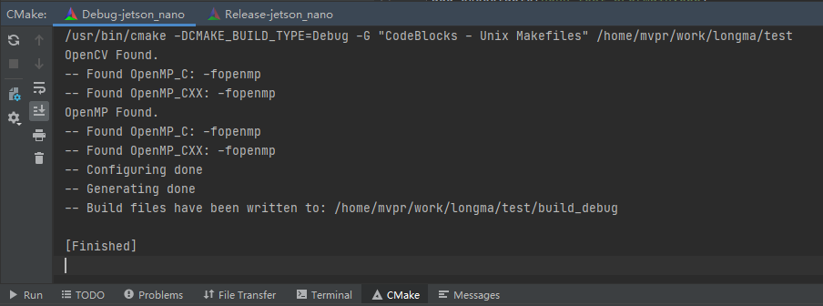

    - 编译Messages

        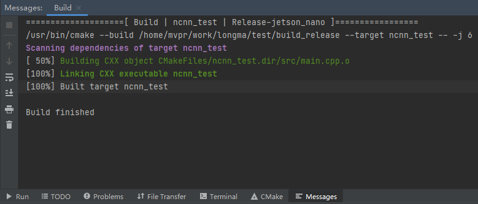

    - Run 

        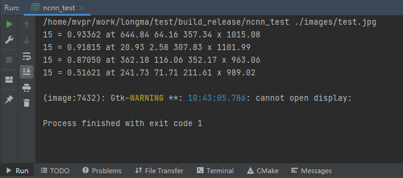

